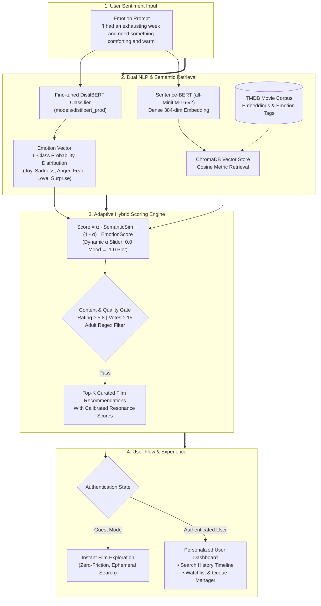

# Moofy — Emotion-Aware Cinema Recommendation Platform

<p align="center">
  
</p>

<p align="center">
  <strong>Translating human sentiment into resonant cinema through fine-tuned NLP & vector embeddings.</strong>
</p>

<p align="center">
  <a href="https://img.shields.io/badge/Python-3.10+-3776AB?style=flat&logo=python&logoColor=white"></a>
  <a href="https://img.shields.io/badge/Frontend-React%2018%20%2F%20Vite-61DAFB?style=flat&logo=react&logoColor=white"></a>
  <a href="https://img.shields.io/badge/Backend-FastAPI-009688?style=flat&logo=fastapi&logoColor=white"></a>
  <a href="https://img.shields.io/badge/AI%2FML-DistilBERT%20%2B%20SBERT-EE4C2C?style=flat&logo=huggingface&logoColor=white"></a>
  <a href="https://img.shields.io/badge/Vector%20Store-ChromaDB-blue?style=flat"></a>
  <a href="https://img.shields.io/badge/Container-Docker-2496ED?style=flat&logo=docker&logoColor=white"></a>
  <a href="https://img.shields.io/badge/Type-Personal%20Project-2563EB?style=flat"></a>
  <a href="https://img.shields.io/badge/Status-Completed-success?style=flat"></a>
</p>

<p align="center">
  <a href="#overview">Overview</a> •
  <a href="#key-features">Features</a> •
  <a href="#machine-learning-architecture">ML Architecture</a> •
  <a href="#my-roles--contributions">Contributions</a> •
  <a href="#tech-stack">Tech Stack</a> •
  <a href="#folder-structure">Folder Structure</a> •
  <a href="#quickstart--installation">Quickstart</a> •
  <a href="#deployment">Deployment</a> •
  <a href="#api-reference">API Docs</a>
</p>

---

> [!NOTE]
> **Evolution from Cinema.io (Independent Initiative)**  
> **Moofy** was developed as a direct continuation and architectural evolution of [**`Cinema.io`**](https://github.com/EdwinAntoniee/Cinema.io-Personalized-Movie-Recommendation), our team's earlier NLP movie recommendation project. Recognizing substantial room for improvement in the original concept—particularly regarding recommendation transparency, low-latency scalable vector retrieval, and full-stack personalization—this project is **entirely my own independent work** built from scratch to elevate that vision into a production-grade, end-to-end platform.

## 🎬 Overview

**Moofy** is an intelligent, full-stack movie discovery platform designed around human emotion. Rather than relying solely on generic genre tags or static popularity algorithms, Moofy analyzes natural-language prompts expressing how a user is feeling (*"I had an exhausting week and need something comforting and warm"*) and translates that emotional nuance into resonant film recommendations.

The platform blends:
1. **Fine-tuned DistilBERT Emotion Classifier** predicting a 6-class probability distribution across *Joy, Sadness, Anger, Fear, Love, and Surprise*.
2. **Sentence-BERT (`all-MiniLM-L6-v2`) + ChromaDB Vector Engine** performing high-dimensional semantic search over the TMDB movie corpus.
3. **Adaptive Hybrid Scoring Engine** allowing users to dynamically balance emotional resonance against plot semantics.

---

## ✨ Key Features

* **🎭 Natural Language Emotion Detection**: Express sentiments freely in plain English. The fine-tuned transformer predicts the primary mood and probability breakdown across 6 core emotions.
* **🎛️ Dynamic Recommendation Focus**: Real-time slider adjusting the synthesis between **Mood Focus** (emotional resonance) and **Plot Focus** (semantic plot alignment).
* **🛡️ Content Safety & Quality Filtering**: Automatic filtering rejecting adult/erotic content and unvetted placeholder releases (enforcing minimum quality rating and vote thresholds).
* **👤 Guest vs. Authenticated User Flows**:
  * **Guest Mode**: Instant zero-friction emotion search and film exploration.
  * **Authenticated Mode**: Automatically archived **History** timeline and personal **Watchlist & Queue** manager.

---

## 🧠 Machine Learning Architecture



### Hybrid Score Formulation
$$\text{Score} = \alpha \cdot \text{SemanticSim}(\vec{u}, \vec{m}) + (1 - \alpha) \cdot P(\text{Emotion}_m \mid \text{Prompt})$$
* **$\alpha = 0.0$**: Pure Emotional Resonance (matches movies that strictly mirror the detected emotional state).
* **$\alpha = 0.5$**: Balanced Synthesis (50% Emotion / 50% Plot semantics).
* **$\alpha = 1.0$**: Pure Semantic Search (matches movies strictly by plot synopsis alignment).

---

## 👨‍💻 My Roles & Contributions

- **Solo Initiative & Evolution from Cinema.io**
  - Conceived, architected, and built this project independently as an advanced, production-grade evolution of our earlier team project ([`Cinema.io`](https://github.com/EdwinAntoniee/Cinema.io-Personalized-Movie-Recommendation)), identifying key areas for improvement in the original concept and elevating it with modern vector search, fine-tuned transformer inference, and a complete full-stack architecture.
- **Machine Learning & NLP Engineering**
  - Fine-tuned a multi-class DistilBERT classifier on curated emotional dialogue and the GoEmotions corpus, outputting calibrated probability distributions across 6 canonical emotions.
  - Implemented semantic retrieval using Sentence-BERT (`all-MiniLM-L6-v2`) and ChromaDB vector indexing to generate dense 384-dimensional embeddings over the TMDB movie catalog.
  - Formulated the dynamic alpha-weighted Hybrid Scoring Engine balancing semantic plot alignment with emotional resonance.
- **Full-Stack Backend Development**
  - Developed high-performance asynchronous REST endpoints using **FastAPI** and **Pydantic v2** validation.
  - Implemented secure JWT-based bearer authentication with password hashing via Passlib.
  - Designed SQLite database schemas via **SQLAlchemy ORM** to manage user accounts, chronological Emotion History logs, and personal Watchlists.
- **Frontend Architecture & UI/UX**
  - Built an interactive, single-page application using **React 18** and **Vite** featuring Lucide icons and customized CSS typography (`Bodoni Moda`, `Inter`).
  - Designed intuitive real-time controls including dynamic mood-vs-plot focus sliders, emotion probability gauges, and mobile-first responsive viewports.
- **DevOps & Production Packaging**
  - Structured a multi-stage **Docker** build containerizing the Vite production bundle and FastAPI server for lightweight deployment.
  - Configured health-check endpoints, automated environment variable loaders (`.env`), and Vercel routing policies.

---

## 🛠️ Tech Stack

| Layer | Technologies |
| :--- | :--- |
| **Backend API** | **FastAPI**, **Uvicorn**, **Pydantic v2**, **SQLAlchemy** (SQLite) |
| **Machine Learning** | **PyTorch**, **Hugging Face Transformers** (DistilBERT), **Sentence-Transformers** (`all-MiniLM-L6-v2`), **ChromaDB** |
| **Frontend UI** | **React 18**, **Vite**, **Lucide React**, **CSS3 Tokens** (`Bodoni Moda`, `Inter`, `JetBrains Mono`) |
| **Security & Auth** | **JWT** (JSON Web Tokens), **Passlib** (PBKDF2/Bcrypt) |
| **DevOps & Containers** | **Docker** (Multi-Stage Build), **Docker Compose**, **Vercel** (`vercel.json`) |

---

## 📂 Folder Structure

```
Moofy/
├── assets/                       # Visual branding assets and logos
│   └── branding/                 # High-resolution logos and icons
├── backend/                      # FastAPI backend application
│   ├── app/
│   │   ├── api/                  # REST API route handlers (auth, recommend, history, watchlist)
│   │   ├── core/                 # App configuration, security (JWT), and constants
│   │   ├── db/                   # Database session and SQLite setup
│   │   ├── models/               # SQLAlchemy database ORM entities
│   │   ├── schemas/              # Pydantic v2 request/response validation schemas
│   │   └── services/             # Recommendation engine, emotion classifier & vector store
│   └── tests/                    # Backend automated unit and integration tests
├── chroma_db/                    # ChromaDB vector index database files
├── data/                         # TMDB movie catalog and emotion-annotated datasets
├── frontend/                     # React 18 + Vite frontend application
│   ├── src/                      # UI components, pages, context, and custom hooks
│   └── public/                   # Static web assets and icons
├── models/                       # Serialized machine learning models
│   └── distilbert_prod/          # Fine-tuned DistilBERT emotion classifier weights & tokenizer
├── 1_research_and_experiments/   # Model exploration, benchmarking, and training notebooks
├── docker-compose.yml            # Container orchestration specification
├── Dockerfile                    # Multi-stage production container build definition
├── requirements.txt              # Production Python package dependencies
├── run_app.py                    # Unified application launch utility
├── vercel.json                   # Frontend deployment routing configuration
└── README.md                     # Comprehensive project documentation
```

---

## 🚀 Quickstart & Installation

### Prerequisites
* Python 3.10+
* Node.js 18+ and npm

### 1. Clone Repository
```bash
git clone https://github.com/EdwinAntoniee/Moofy.git
cd Moofy
```

### 2. Backend Setup
```bash
# Create and activate Python virtual environment
python -m venv venv
# On Windows:
venv\Scripts\activate
# On Linux/macOS:
# source venv/bin/activate

# Install dependencies
pip install -r requirements.txt

# Start Backend Server (runs on http://localhost:8000)
python run_app.py
```

### 3. Frontend Setup
```bash
cd frontend
npm install
npm run dev
# App is live at http://localhost:5173
```

---

## 🐳 Docker Deployment (1-Click)

Moofy includes a multi-stage production Docker configuration that compiles the React frontend and packages the FastAPI backend into a single lightweight container.

```bash
# Build and run containerized application
docker compose up --build
```
Access the application at `http://localhost:8000`.

---

## 📚 API Reference

### Health Check
* `GET /health` — Returns API service status and version.

### Recommendation
* `POST /api/recommend`
  ```json
  {
    "prompt": "I want an emotional, reflective story set in space",
    "alpha": 0.5,
    "top_k": 4,
    "filter_emotion": "ALL"
  }
  ```

### Authentication
* `POST /api/auth/register` — Create account (`email`, `username`, `password`).
* `POST /api/auth/login` — Sign in and receive JWT bearer token.
* `GET /api/auth/me` — Retrieve current authenticated user profile.

### Moods History
* `GET /api/history` — Get user's logged sentiment search history timeline.
* `DELETE /api/history/{id}` — Delete a specific history entry.
* `DELETE /api/history` — Clear all search history.

### Watchlist & Queue
* `GET /api/watchlist` — Retrieve saved movies (`status=all`, `plan_to_watch`, `watched`).
* `POST /api/watchlist` — Add film to queue or mark as watched.
* `PATCH /api/watchlist/{movie_id}` — Update status (`plan_to_watch` $\leftrightarrow$ `watched`).
* `DELETE /api/watchlist/{movie_id}` — Remove film from watchlist.

---

## 📄 License & Acknowledgments
* TMDB dataset & imagery provided in accordance with TMDB API terms.
* Fine-tuned on Google Research's **GoEmotions** corpus and curated film synopses.
